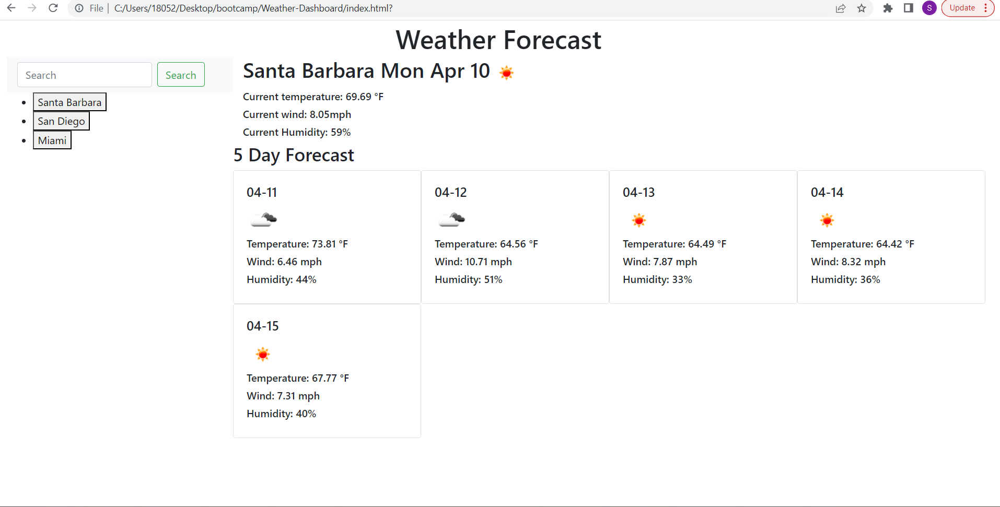

# Weather-Dashboard
Dashboard showing the current weather as well as the forecast for the next five days. 
 

## Technology Used 

| Technology Used         | Resource URL           | 
| ------------- |:-------------:| 
| HTML    | [https://developer.mozilla.org/en-US/docs/Web/HTML](https://developer.mozilla.org/en-US/docs/Web/HTML) | 
| CSS     | [https://developer.mozilla.org/en-US/docs/Web/CSS](https://developer.mozilla.org/en-US/docs/Web/CSS)      |   
| Git | [https://git-scm.com/](https://git-scm.com/)     |    
|JavaScript| [https://developer.mozilla.org/en-US/docs/Web/JavaScript](https://developer.mozilla.org/en-US/docs/Web/JavaScript)|
|Bootstrap|[https://getbootstrap.com/](https://getbootstrap.com/)|

## Description 

[Visit Weather Dashboard](https://sheaschwenn.github.io/Weather-Dashboard/)

A weather dashboard that takes a users desired city as input and renders current weather data as well as a five day forecast.  Each item that a user searches is added to their search history which will persist even when the page is refreshed.  Each item in the search history is also clickable, when clicked the respective updated data for that city is shown. 


## Table of Contents 


* [JavaScript Example](#javascript-example)
* [Usage](#usage)
* [Learning Points](#learning-points)
* [Author Info](#author-info)
* [Credits](#credits)
* [License](#license)


## JavaScript Example

Creating a fetch request to access the five day weather forecast data. Using a for loop to iterate through and inject HTML with dynamic variables to create a card that contains temperature, wind speed, humidity and representative icon for each day.  


```js
 fetch(requestUrlForecast)

        .then(function (response) {
            return response.json();
        })
        .then(function (data) {
            
            forecast.textContent = ""
            for (var i = 6; i < data.list.length; i = i + 8) {
                
                var id1 = data.list[i].weather[0].icon
                
                var iconUrl1 = 'https://openweathermap.org/img/w/' + id1 + '.png'
                
                forecast.innerHTML += `     <div id = "day-1" class="card w-20 col-lg-2.4" style="width: 18rem;">
                <div class="card-body">
                    <h5 id ="date-1" class= card-title">${data.list[i].dt_txt.slice(5, 11)}</h5>
                    
                    <h6 id="temp1">${"Temperature: " + data.list[i].main.temp + " °F"} </h6>
                    <h6 id="wind1"> ${"Wind: " + data.list[i].wind.speed + " mph"}</h6>
                    <h6 id="humidity1">${"Humidity: " + data.list[i].main.humidity + "%"} </h6>
            
                </div>
            </div>`
            }

        });

```


## Usage 
Dashboard that will display a users searched citys current weather conditions as well as the five day forecast for that city.  




## Learning Points 
This project was a great introduction to APIs along with a touch of bootstrap.  I also got to solidify my understanding of local storage and use a for loop to inject html into my webpage.  

* APIs
* bootstrap
* innerHTML
* continuation of local storage and for loops 


## Author Info

### Shea Schwennicke


* [Portfolio](https://sheaschwenn.github.io/Portfolio/)
* [LinkedIn](https://www.linkedin.com/in/shea-schwennicke-76a378210/)
* [Github](https://github.com/sheaschwenn)


## License
MIT License

For more information please refer to the LICENSE in the repo.


---

© 2023 edX Boot Camps LLC. Confidential and Proprietary. All Rights Reserved.